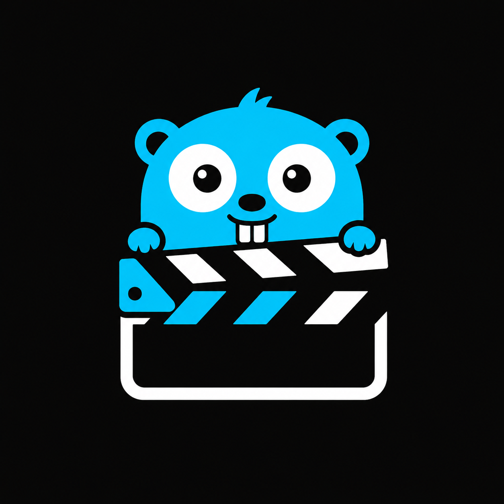

<div align="center">



**Open-source, offline desktop video editor — a privacy-respecting CapCut alternative.**

A native cross-platform app built with Go + Wails and a Vue 3 frontend.
Powered by FFmpeg, with zero cloud, zero telemetry, and zero account required.

> ⚠️ **IMPORTANT NOTICE:** The **Design** tab/section is currently under active development. There is no point to visit it yet as features are being actively integrated.

> Latest implementation note: the repo now includes a tag-driven GitHub release workflow for shipping the latest Windows build automatically.

[](#-roadmap)
[](https://go.dev)
[](https://wails.io)
[](https://vuejs.org)
[](./LICENSE)
[](#-platforms)

</div>

---

## ✨ What is Gocut?

**Gocut** is a fast, lightweight, **fully offline** video editor for the desktop.
It targets short-form creators, indie YouTubers, educators, Linux users, and
anyone who wants a capable editor without uploading their footage to someone
else's server.

-  **Multi-track timeline** — video, audio, text, and stickers on dedicated tracks
-  **Live preview** — frame-accurate scrubbing via FFmpeg with a low-latency mode during playback
-  **DaVinci Resolve Fusion-style Node Compositor (Design Section)** — build graphics and animations via an interactive node graph:
   - Drag wires or click-to-connect nodes with color-coded compatibility cues and port tooltips
   - Auto-connect nodes inline upon creation when a parent node is selected
   - Insert nodes in-between connections by hovering and dropping onto the line
   - Detach nodes and heal/reconnect the remaining path automatically by holding **Left Shift** + dragging
   - Animate nodes (Text, Rectangles, Ellipses, Stars, Polygons, Gradients) with custom easing curves and keyframes
-  **Color grading** — brightness, contrast, saturation, hue, sharpness, vignette, grain, and blur
-  **Text overlays** — full styling (font, size, weight, color, stroke, shadow, background)
-  **Stickers & overlays** — image-based overlays with transform, rotation, and opacity
-  **Transitions** — 11 built-in `xfade` transitions (fade, dissolve, wipe, slide, zoom, …) with **live CSS preview** during playback
-  **Visual clip indicators** — timeline clips show icons when transitions (↔) or color effects (🎨) are applied
-  **Audio engine** — per-clip volume, muting, and (in-progress) waveform visualization
-  **Background export** — render MP4 (H.264 + AAC) or audio-only MP3 in a Go goroutine, with progress and cancel
-  **Portable `.Gocut` projects** — save, load, and share your project as a single JSON file directly from the editor
-  **Auto-assign FilePath** — auto-configures project file location to the first imported media asset's directory for seamless background autosaves
-  **Auto-save** — transparently saves draft history to SQLite every 60 s, writing directly to the `.gocut` file once it is defined on disk
-  **Manage Recents** — clean recent projects list on the Home screen showing readable file paths, with options to remove individual items or clear all projects from history

> Gocut is currently in the **v0.1.0 MVP** milestone. See the [Roadmap](#-roadmap) below.

---

## 📑 Table of Contents

- [Why Gocut?](#-why-gocut)
- [Screenshots](#-screenshots)
- [Platforms](#-platforms)
- [Quick Start](#-quick-start)
- [Live Development](#-live-development)
- [Building](#-building)
- [Project Structure](#-project-structure)
- [Architecture](#-architecture)
- [Tech Stack](#-tech-stack)
- [Supported Formats](#-supported-formats)
- [Keyboard Shortcuts](#-keyboard-shortcuts)
- [Data & Storage](#-data--storage)
- [Roadmap](#-roadmap)
- [Contributing](#-contributing)
- [License](#-license)
- [Acknowledgements](#-acknowledgements)

---

## 🤔 Why Gocut?

CapCut is the dominant tool for short-form video editing, but it is:

-  Cloud-dependent and privacy-invasive (uploads footage to servers)
- Not open source
- 🐧 Not a first-class desktop experience on Linux
-  Monetized through AI upsells behind paywalls

Gocut exists to be a **credible, local, open-source alternative** that respects
your data, runs anywhere.

---

## 📸 Screenshots

> _Coming soon — UI in active development._

The editor follows a familiar layout: a top bar, a left panel for assets &
effects, a centered preview canvas with transport controls, a resizable
timeline at the bottom, and a right-side inspector.

**Design tokens** (see `frontend/tailwind.config.js`):

| Token        | Value                                    |
| ------------ | ---------------------------------------- |
| `bg`         | `#0F0F0F` — main background              |
| `panel`      | `#1A1A1A` — panels, cards                |
| `border`     | `#2A2A2A` — separators                   |
| `accent`     | `#00D4FF` — primary cyan                 |
| `text`       | `#E8E8E8` / `#888888`                    |
| `font-dm-sans` | `DM Sans` (UI)                         |
| `font-jetbrains-mono` | `JetBrains Mono` (timecode)     |

---

## 🖥️ Platforms

| OS            | Status                            |
| ------------- | --------------------------------- |
| Windows 10+   | ✅ Primary dev target              |
| macOS 12+     | ✅ Wails-supported                 |
| Linux (Ubuntu 20.04+) | ✅ WebKit2GTK / Chromium via Wails |

> **FFmpeg is required at runtime** for all media processing. Gocut auto-detects
> `ffmpeg` and `ffprobe` on `PATH`. See [FFmpeg installation](#-ffmpeg-installation).

---

## 🚀 Quick Start

### Prerequisites

- **Go 1.25+**
- **Node.js 18+** and **npm**
- **Wails v2 CLI** — `go install github.com/wailsapp/wails/v2/cmd/wails@latest`
- **FFmpeg** and **ffprobe** on your `PATH` (see below)

### FFmpeg installation

```bash
# macOS
brew install ffmpeg

# Ubuntu / Debian
sudo apt update && sudo apt install -y ffmpeg

# Windows (winget)
winget install Gyan.FFmpeg

# Or download a static build from https://ffmpeg.org/download.html
```

Verify it's discoverable:

```bash
ffmpeg -version
ffprobe -version
```

### Clone & run

```bash
git clone https://github.com/<your-username>/Gocut.git
cd Gocut
go install github.com/wailsapp/wails/v2/cmd/wails@latest
cd frontend && npm install && cd ..
wails dev
```

That's it — `wails dev` will install JS deps, build the Go bindings, and launch
the desktop app with hot-reload for the Vue frontend.

---

## 🛠️ Live Development

To run in **live development mode**, run `wails dev` in the `Gocut/` directory
(this is the directory containing `wails.json`).

This runs a Vite development server that provides very fast hot-reload of
frontend changes. If you want to develop in a browser and have access to your
Go methods, there is also a dev server that runs on
**http://localhost:34115** — connect to it in your browser, and you can call
your Go code from devtools.

The dev server expects a Go method like `App.Greet` to be bound before it
will work.

### Frontend-only dev

```bash
cd Gocut/frontend
npm install
npm run dev      # Vite on http://localhost:5173
```

> ⚠️ Frontend-only mode works for UI tweaks, but Wails bindings (`wailsjs/go/...`)
> will return errors until you run the app through `wails dev` or `wails build`.

---

## 📦 Building

To build a redistributable, production-mode package, use `wails build`:

```bash
cd Gocut
wails build
```

To publish a tagged release automatically, push a version tag:

```bash
git tag v0.1.0
git push origin v0.1.0
```

The GitHub Actions workflow in `.github/workflows/release.yml` will build the latest Windows binary and attach it to the release.

The compiled binary is written to `build/bin/`:

| Platform | Output                  |
| -------- | ----------------------- |
| Windows  | `build/bin/Gocut.exe`   |
| macOS    | `build/bin/Gocut.app`   |
| Linux    | `build/bin/Gocut`       |

### Cross-platform builds

`wails build` targets the host OS by default. To cross-compile, use the
standard Wails cross-build instructions for your target platform.

### Linux note

Wails on Linux uses WebKit2GTK. Make sure the following packages are installed
on Ubuntu / Debian:

```bash
sudo apt install -y libgtk-3-dev libwebkit2gtk-4.0-dev pkg-config build-essential
```

## 🏗️ Architecture

```
┌───────────────────────────────────────────────────────────────┐
│                   Wails Desktop Shell                         │
│                                                               │
│   ┌──────────────────┐     ┌──────────────────────────────┐   │
│   │   Vue Frontend   │ ◄─► │      Go Backend (RPC)        │   │
│   │                  │     │                              │   │
│   │  Timeline UI     │     │  - App (Wails bindings)      │   │
│   │  Preview Canvas  │     │  - FFmpeg executor           │   │
│   │  Asset Pool      │     │  - Project manager + SQLite  │   │
│   │  Properties      │     │  - Render queue (goroutines) │   │
│   │  Export Dialog   │     │  - Thumbnail / Frame caches  │   │
│   │                  │     │  - Waveform analyzer         │   │
│   │                  │     │  - Auto-saver (60s ticker)   │   │
│   │                  │     │  - In-app media HTTP server  │   │
│   └──────────────────┘     └──────────────┬───────────────┘   │
│                                           │                   │
│                            ┌──────────────▼──────────────┐    │
│                            │  SQLite (project DB)        │    │
│                            │  Disk cache (thumb/audio)   │    │
│                            │  FFmpeg child processes     │    │
│                            └─────────────────────────────┘    │
└───────────────────────────────────────────────────────────────┘
```

### Communication patterns

- **Frontend → Backend:** Wails Go bindings (synchronous RPC). The full
  surface lives on `app.App` — see [`frontend/src/lib/wails.js`](frontend/src/lib/wails.js).
- **Backend → Frontend:** `runtime.EventsEmit` pushes async events:
  - `render:progress` — percent, current/total time, FPS, status
  - `project:autosaved` — timestamp of the last auto-save tick
  - `asset:thumbnailReady` / `asset:waveformReady` — async asset enrichment
  - `ffmpeg:notFound` — emitted when FFmpeg is not on `PATH`

### Why Wails?

Wails lets us ship a **single binary** desktop app with a real web UI, while
keeping the heavy lifting (FFmpeg, SQLite, file system) in Go where it
belongs. No Electron, no Chromium-on-CI, ~10× smaller binaries.

---

## 🧰 Tech Stack

### Backend (Go)

| Concern                | Library / Approach                            |
| ---------------------- | --------------------------------------------- |
| Desktop shell          | [`wailsapp/wails/v2`](https://wails.io) v2.12  |
| Media processing       | FFmpeg via `os/exec`, with a typed arg builder |
| Project storage        | [`ncruces/go-sqlite3`](https://github.com/ncruces/go-strftime) (WASM-backed, no CGo required) |
| Thumbnail cache        | Custom disk-based LRU (~500 MB cap)            |
| Frame cache            | In-memory ring buffer (120 entries, 30 s TTL) |
| Background jobs        | Goroutines + buffered channels + `context`     |
| Audio extraction       | `ffmpeg -vn -c:a libmp3lame` on demand, cached to disk |
| Media file serving     | In-process `http.ServeMux` on `127.0.0.1:<random>` |

### Frontend (Vue + JavaScript)

| Concern                | Library                                       |
| ---------------------- | --------------------------------------------- |
| Build tool             | [Vite](https://vitejs.dev) 6                  |
| Framework              | [Vue 3](https://vuejs.org) 5 (`<script setup>`) |
| State                  | [Pinia](https://pinia.vuejs.org) 2            |
| Styling                | [Tailwind CSS](https://tailwindcss.com) 3.4  |
| Canvas overlays        | [`vue-konva`](https://github.com/konvajs) + Konva 9 |
| Waveforms              | [`wavesurfer.js`](https://wavesurfer.xyz) 7   |
| Animations             | [GSAP](https://gsap.com) 3                    |
| Icons                  | [Lucide](https://lucide.dev) (vue-next)        |

---

## 📂 Supported Formats

### Video
`mp4`, `mov`, `avi`, `mkv`, `webm`

### Audio
`mp3`, `wav`, `aac`, `flac`

### Image
`png`, `jpg`, `jpeg`, `gif`, `webp`

### Project files
- Native: `.Gocut` (single JSON file)
- Legacy import: `.json` (compatible with the same schema)

### Export
- `mp4` (H.264 + AAC) — primary format
- `mp3` (MP3 audio-only) — supported with the `libmp3lame` encoder
- `webm` (VP9, `libvpx-vp9`) — supported with `libopus` audio
- `gif` — supported via FFmpeg `palettegen`/`paletteuse` optimization
- `aac` (audio-only, ADTS) — supported with the native `aac` encoder

> **Note:** Removing a video clip from the timeline invalidates in-flight and
> cached preview frames, so the removed source is not reused by the preview.

---

## ⌨️ Keyboard Shortcuts

| Shortcut               | Action                       |
| ---------------------- | ---------------------------- |
| `Space`                | Play / pause                 |
| `←` / `→`              | Step one frame back / forward |
| `Delete` / `Backspace` | Delete selected clip         |
| `S`                    | Toggle snap-to-edges         |
| `Ctrl/Cmd + S`         | Save project                 |
| `Ctrl/Cmd + E`         | Open export dialog           |

> _More J/K/L shuttle and full transport shortcuts are planned for v1.0._

---

## 💾 Data & Storage

Everything Gocut writes at runtime lives under **`~/.gocut/`**:

```
~/.gocut/
├── gocut.db                  # SQLite project database (projects, assets)
├── thumbnails/               # Cached per-asset thumbnails (PNG)
├── audio_cache/              # On-demand MP3 extractions (md5(path).mp3)
└── preview/                  # Preview frame cache keys
```

The in-process media server runs on a random free port on `127.0.0.1` and is
exposed to the JS side via `GetMediaServerPort()`. It refuses to serve any
path that is not part of the current project's asset list.

---

## 🗺️ Roadmap

The full product spec lives in [`prd.md`](../prd.md) at the repo root.

### ✅ v0.1.0 (current MVP)

- [x] Project create / save / load (`.Gocut` JSON files)
- [x] Media import (video / audio / image) with format validation
- [x] Async thumbnail + waveform generation
- [x] Multi-track timeline (video, audio, text, sticker) with drag, trim, split, delete
- [x] Frame-accurate preview (paused) + low-latency playback mode
- [x] Text overlays with full styling
- [x] Stickers & image overlays with transform
- [x] Stickers export with transform (position, rotation, opacity, flip, scale)
- [x] Color grading (brightness, contrast, saturation, hue, sharpness, vignette, grain, blur)
- [x] 11 transitions via FFmpeg `xfade`
- [x] **Live CSS transition preview** — fade, dissolve, wipe, slide, zoom, flip, circle, pixelize, and blur transitions animate in real-time during playback (no FFmpeg round-trip needed)
- [x] **Visual clip indicators** — timeline clips display transition (↔) and effect (🎨) icons so users can see at a glance which clips have modifications applied
- [x] Export to MP4 (H.264 + AAC) with background render, progress events, and cancel
- [x] Export audio-only MP3 with background render, progress events, and cancel
- [x] Export to WebM (VP9, `libvpx-vp9`) with background render, progress events, and cancel
- [x] Export to GIF via `palettegen`/`paletteuse` with background render, progress events, and cancel
- [x] Export audio-only AAC (ADTS) with background render, progress events, and cancel
- [x] Audio controls — per-clip volume, mute, loudness normalization (`loudnorm`), noise reduction (`afftdn`), BGM loop, and ducking
- [x] System font picker (`GetSystemFonts()` binding)
- [x] Auto-save every 60 s
- [x] Cross-platform: Windows, macOS, Linux
- [x] In-app media HTTP server (audio extraction on demand, cached)
- [x] Recent projects on home screen

### 🚧 Known gaps (being worked on)

- Live transition preview uses CSS approximations (clip-path, opacity, transform). The final exported video uses FFmpeg's native `xfade` filter for pixel-accurate transitions.
- True cross-fade transitions (overlapping two clips) require complex filter graph chaining — currently transitions apply as intro animations on the incoming clip.
- Render queue is single-worker by design (avoids CPU contention with FFmpeg).
- Some PRD features (chroma key, LUTs, multi-cam, plugin marketplace, AI effects)
  are intentionally **out of scope** for v1.0.

### 🛣️ v1.0 (planned)

- [ ] All timeline niceties — snap, ripple delete, multi-select, razor tool
- [ ] Full keyframe animation system (transform / opacity / volume)
- [ ] Complete color suite + LUT import + 12 filter presets
- [ ] Text animations (12 presets)
- [ ] Built-in sticker library / asset pack
- [ ] Audio waveform rendering in the timeline
- [ ] Audio fade-out handles + per-clip volume keyframe envelope drawing (inspector UI)
- [ ] Chroma key
- [ ] Multi-job render queue
- [ ] Multiple video + audio tracks
- [ ] Performance pass & cross-platform QA

---

## 🤝 Contributing

Gocut is an early-stage project and **every contribution helps** — code,
issues, documentation, design, and testing are all welcome.

### Ground rules

- **Format:** `gofmt` for Go, ESLint for the frontend (`npm run lint`).
- **Commits:** small, focused, with a clear subject line.
- **Pull requests:** open a draft PR early if you want design feedback.
- **Issues:** please use the issue templates and include OS, Gocut version
  (`GetAppVersion()` returns it), and reproduction steps.

### Local development loop

```bash
# 1. Make sure FFmpeg is on PATH
ffmpeg -version

# 2. Run with hot-reload
cd Gocut
wails dev

# 3. Build the host-platform binary
wails build

# 4. Create a tagged release (optional)
git tag v0.1.0
git push origin v0.1.0
```

### Good first issues

A few candidates right now:

- Add a built-in sticker library / asset pack
- Add unit tests for `internal/ffmpeg/builder.go` filter chain output
- Implement true cross-fade overlap logic between adjacent clips
- Add transition duration slider to the Transitions panel

### Project structure pointers

- All RPC methods live on `internal/app/app.go` — add a new method there and
  Wails will regenerate the TypeScript binding automatically.
- Frontend stores (`stores/`) are the source of truth for the UI; the Go side
  treats the project as an opaque JSON document passed through `SaveProject`
  / `LoadProject`.
- Heavy work belongs in Go goroutines; the frontend listens for progress via
  Wails events.

---

## 📄 License

Gocut is released under the **Apache License 2.0**. See [`LICENSE`](./LICENSE)
for the full text.

> ⚖️ **FFmpeg note:** Gocut does **not** statically link FFmpeg. It calls
> `ffmpeg` / `ffprobe` from your system `PATH` at runtime, which keeps the
> binary LGPL-friendly. If you ship a static FFmpeg alongside Gocut (e.g. via
> a Windows installer), make sure the FFmpeg licensing terms are respected
> and that proper attribution is included with your distribution.

---

## 🙏 Acknowledgements

Gocut stands on the shoulders of giants:

- [Wails](https://wails.io) — for the Go + Web desktop bridge
- [FFmpeg](https://ffmpeg.org) — for every pixel that gets decoded, filtered, and rendered
- [Vue 3](https://vuejs.org) + [Vite](https://vitejs.dev) + [Pinia](https://pinia.vuejs.org)
- [Tailwind CSS](https://tailwindcss.com), [Konva.js](https://konvajs.org),
  [WaveSurfer.js](https://wavesurfer.xyz), [GSAP](https://gsap.com), [Lucide](https://lucide.dev)
- [ncruces/go-sqlite3](https://github.com/ncruces/go-strftime) — pure-Go SQLite via WASM

And, of course, the open-source video editor community that proved this kind
of project is worth building.

---

<div align="center">

**Gocut** — _Build fast. Edit local. Ship open._

Made with ❤️ using Go, Wails, and Vue.

</div>
